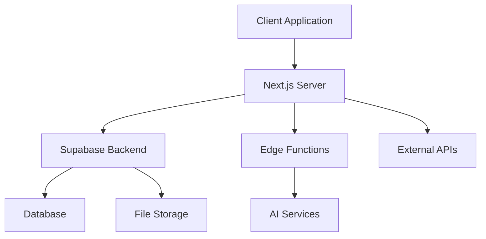
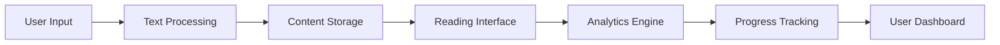

<role> You are my CTO expert in webapp design </role> 

<context> The objective of this project is to create a web-based text reader application that helps users improve both their reading comprehension and reading speed. The core functionality of this application includes:

Text Input Features:

- Users can upload texts through various methods
- Supports multiple formats including books and copy-pasted paragraphs
- Flexible text input options

Reading Display Modes:

1. Rapid Serial Visual Presentation (RSVP)
    - Displays one word at a time
    - Words change at high speed
    - Instead of showing entire paragraphs, presents individual words in rapid succession for speed reading
2. Enhanced Word Visibility
    - Displays text with the first and last letter of each word in bold
    - Helps improve word recognition and reading speed
3. Part-of-Speech Enhancement
    - Automatically detects different word types (nouns, verbs, adjectives)
    - Highlights specific parts of speech (verbs, nouns, or person names) in bold
    - Aids in comprehension and grammar recognition

Customization Options:

- Adjustable word refresh rate
- Configurable number of words displayed simultaneously
- Flexible text layout options:
    - Single-line display
    - Two-line display
    - Variable word count per line (e.g., one word, two words, or five words across multiple lines)

The application allows users to:

1. Upload their chosen text
2. Select their preferred reading format
3. Adjust various parameters to optimize their reading experience
4. Practice and improve their reading speed using these tools

 
Additional Features for the Reading Enhancement Application

1. Authentication System
    - User authentication implemented through Supabase
    - Secure user accounts and data management
2. Personal Libraries
    - Digital library system for storing uploaded texts
    - Historical tracking of all previously uploaded materials
    - Text management portal features:
        - Upload new texts
        - Access to previously uploaded texts
        - Progress tracking for each text
        - Reading status indicators and bookmarking
3. Analytics Dashboard
    - Comprehensive reading statistics:
        - Number of books read
        - Regular reading patterns
        - Reading speed metrics
    - Progress tracking features:
        - Comparison of previous vs. current reading speeds
        - Improvement calculations (e.g., potential additional books readable per week)
        - Performance visualization
4. Reading Assessment Tools
    - Pre/Post Analysis Feature:
        - Baseline reading speed test with traditional method
        - Comparative test using the innovative word-refresh method
        - Speed improvement calculations and analysis
5. Comprehension Testing
    - LLM-powered comprehension checks:
        - Chapter-end quizzes
        - Basic comprehension questions
        - Automated question generation for different text sections
        - Progress tracking of comprehension scores
6. Interactive Reading Interface
    - Media player-style control panel:
        - Play/pause functionality
        - Rewind/forward options
        - Progress bar
    - Auxiliary information panel:
        - Word display area
        - Options menu
        - Library access
        - Reading controls
7. Accessibility Features
    - Light/Dark mode toggle
    - Visual comfort settings
    - Interface customization options </context>

<wayofwork> I use VS Code, in Windows, using React, Node, Supabase, Zustand. Have a conversational tone: if you do not have enough information to proceed with your goal, ask me questions. Be direct, exhaustive and professional and avoid common mistakes. Use coding best practices, such as i) documenting the code with succint explanations, ii) library import checks, iii) try-except error catching, iv) using the most up-to-date libraries and frameworks, v) modularity and testability of components, vi) logging, vii) scalability, viii) in-code . Make sure that your code is ready to build. Be extermely detailed, go step by step. </wayofwork> 


# SpeedRead Pro - Product Requirements Document
## Executive Summary

SpeedRead Pro is a sophisticated web-based reading enhancement platform designed to revolutionize how users consume and comprehend written content. The application aims to bridge the gap between traditional reading methods and modern speed-reading techniques, offering a suite of tools that adapt to individual reading preferences and skill levels.

## Product Vision

To become the leading digital platform for reading enhancement by providing innovative, scientifically-backed tools that help users read faster, comprehend better, and manage their reading materials more effectively.

## Target Audience

1. Primary Users:
   - Students (high school and university level)
   - Professionals who need to process large amounts of written content
   - Knowledge workers and researchers
   - Lifelong learners
   - Reading enthusiasts looking to improve their skills

2. Secondary Users:
   - Educators and reading coaches
   - People with reading difficulties
   - ESL/EFL learners
   - Content creators and writers

## Core Value Proposition

1. Speed Enhancement:
   - Scientific approach to increasing reading speed
   - Proven methodologies including RSVP and enhanced word visibility
   - Customizable reading parameters for personalized experience

2. Comprehension Optimization:
   - Intelligent text processing
   - Part-of-speech highlighting
   - Integrated comprehension testing
   - Progress tracking and analytics

3. Content Management:
   - Unified platform for all reading materials
   - Multiple format support
   - Personal digital library
   - Progress tracking across materials

## Key Differentiators

1. Advanced Reading Technologies:
   - Multiple reading enhancement methods in one platform
   - AI-powered comprehension testing
   - Sophisticated progress tracking
   - Personalized reading optimization

2. User Experience:
   - Intuitive, clean interface
   - Seamless content integration
   - Cross-device synchronization
   - Accessibility-first design

3. Educational Value:
   - Structured improvement path
   - Detailed analytics and progress tracking
   - Comprehension verification
   - Personalized recommendations

## Success Metrics

1. User Engagement:
   - Daily active users (DAU)
   - Average session duration
   - Number of texts processed
   - Feature usage distribution

2. Performance Metrics:
   - Reading speed improvement
   - Comprehension accuracy
   - User progression through difficulty levels
   - Content completion rates

3. Technical Metrics:
   - Application performance
   - Server response times
   - Error rates
   - User feedback scores

## Risk Assessment

1. Technical Risks:
   - Text processing accuracy
   - Server load with multiple users
   - Cross-browser compatibility
   - Mobile responsiveness

2. User Experience Risks:
   - Learning curve for new users
   - Reading fatigue
   - Feature discovery
   - Content format compatibility

3. Business Risks:
   - Market adoption
   - Competition
   - Scalability
   - Content licensing

## Success Requirements

1. Technical Requirements:
   - 99.9% uptime
   - <500ms response time
   - Cross-platform compatibility
   - Secure data handling

2. User Requirements:
   - Measurable reading speed improvement
   - Maintained or improved comprehension
   - Positive user satisfaction scores
   - Regular user engagement

3. Business Requirements:
   - User retention > 60% after 3 months
   - Positive user growth rate
   - Sustainable operational costs
   - Competitive feature set

## Impact Goals

1. User Impact:
   - 30% average reading speed improvement
   - 90% user satisfaction rate
   - 80% user retention rate
   - Measurable comprehension improvement

2. Market Impact:
   - Category leadership in reading enhancement
   - Innovation in reading technology
   - Educational sector adoption
   - Industry recognition

3. Social Impact:
   - Improved literacy rates
   - Enhanced educational outcomes
   - Increased accessibility to reading tools
   - Community building around reading improvement

## Future Considerations

1. Expansion Opportunities:
   - Mobile applications
   - Educational partnerships
   - Enterprise solutions
   - API access for developers

2. Technology Evolution:
   - AI/ML enhancements
   - New reading methodologies
   - Advanced analytics
   - Improved accessibility features

3. Market Evolution:
   - International markets
   - Educational sector integration
   - Professional certification
   - Content partnerships

# SpeedRead Pro - Feature Specifications
## 1. Content Management System

### 1.1 Text Input & Processing
- **File Upload System**
  - Support for multiple file formats:
    - PDF (with text extraction)
    - EPUB
    - TXT, RTF
    - DOC/DOCX
    - Markdown
  - Drag-and-drop interface
  - Bulk upload capability
  - File size limit: 50MB per file
  - OCR processing for scanned documents
  - Format conversion and normalization

### 1.2 Text Processing Features
- **Text Parsing & Analysis**
  - Automated chapter detection
  - Section breakdown
  - Paragraph analysis
  - Sentence complexity scoring
  - Reading time estimation
  - Vocabulary difficulty assessment
  - Named entity recognition
  - Language detection and validation

### 1.3 Library Management
- **Personal Library Organization**
  - Custom collections/folders
  - Tags and categories
  - Search functionality
    - Full-text search
    - Metadata search
    - Tag-based search
  - Reading progress tracking
  - Recently accessed items
  - Favorites system
  - Archive functionality

## 2. Reading Enhancement Tools

### 2.1 RSVP (Rapid Serial Visual Presentation)
- **Core RSVP Features**
  - Variable speed control (100-1000 WPM)
  - Adaptive speed based on word length/complexity
  - Pause on punctuation
  - Smart phrase grouping
  - Progress indicator
  - Word count display
  - Time remaining estimate

### 2.2 Enhanced Word Visibility
- **Word Enhancement Features**
  - First/last letter highlighting
  - Syllable separation
  - Word length-based formatting
  - Custom highlight patterns
  - Color coding options
  - Font weight variation
  - Character spacing optimization

### 2.3 Part-of-Speech Enhancement
- **Grammar Visualization**
  - Color-coded parts of speech
  - Verb tense highlighting
  - Subject-verb agreement markers
  - Phrase structure visualization
  - Syntax tree generation (optional)
  - Custom highlighting rules
  - Grammar pattern recognition

## 3. Reading Interface

### 3.1 Display Controls
- **Visual Settings**
  - Font size adjustment
  - Line spacing control
  - Margin width adjustment
  - Column layout options
  - Character spacing
  - Word spacing
  - Paragraph spacing
  - Custom CSS themes

### 3.2 Reading Modes
- **Multiple View Options**
  - Traditional page view
  - Single-line display
  - Multi-line display
  - Focus mode
  - Distraction-free mode
  - Split-screen comparison
  - Side-by-side translation (new)

### 3.3 Navigation Controls
- **Reading Control Panel**
  - Play/pause button
  - Speed adjustment slider
  - Progress bar
  - Chapter navigation
  - Bookmark system
  - Quick jump controls
  - History tracking
  - Multi-device sync

## 4. Progress Tracking & Analytics

### 4.1 Reading Analytics
- **Performance Metrics**
  - Reading speed tracking
  - Comprehension scores
  - Time spent reading
  - Daily/weekly/monthly stats
  - Progress towards goals
  - Speed improvement curve
  - Comprehension trends
  - Activity heatmap

### 4.2 Progress Visualization
- **Data Displays**
  - Interactive charts
  - Progress graphs
  - Speed comparisons
  - Time analysis
  - Performance benchmarks
  - Goal tracking
  - Achievement system
  - Exportable reports

## 5. Learning & Assessment

### 5.1 Comprehension Testing
- **Assessment Tools**
  - Auto-generated quizzes
  - Custom quiz creation
  - Multiple choice questions
  - Short answer questions
  - Summary writing prompts
  - Key concept identification
  - Vocabulary testing
  - Retention checks

### 5.2 Skill Development
- **Training Features**
  - Guided exercises
  - Speed reading drills
  - Comprehension games
  - Vocabulary builders
  - Reading technique tutorials
  - Practice texts
  - Difficulty progression
  - Personalized recommendations

## 6. User Experience & Interface

### 6.1 Accessibility Features
- **Accessibility Tools**
  - Screen reader compatibility
  - Keyboard navigation
  - High contrast modes
  - Font customization
  - Color blind friendly
  - Text-to-speech
  - Voice commands
  - Gesture controls

### 6.2 Customization Options
- **User Preferences**
  - Interface layout
  - Color schemes
  - Keyboard shortcuts
  - Notification settings
  - Default reading modes
  - Custom presets
  - Widget arrangement
  - Toolbar customization

## 7. New Suggested Features

### 7.1 Social & Collaboration
- **Community Features**
  - Reading groups
  - Progress sharing
  - Challenge system
  - Leaderboards
  - Book discussions
  - Note sharing
  - Reading recommendations
  - Expert tips

### 7.2 Integration & Export
- **External Tools**
  - Note-taking app integration
  - Calendar sync
  - Reading schedule
  - Progress exports
  - API access
  - Browser extension
  - Mobile companion app
  - Offline mode

### 7.3 Smart Features
- **AI Enhancements**
  - Personalized difficulty adjustment
  - Reading pattern analysis
  - Content recommendations
  - Adaptive speed optimization
  - Focus detection
  - Performance prediction
  - Learning style adaptation
  - Progress insights

### 7.4 Content Enhancement
- **Advanced Processing**
  - Key point extraction
  - Auto-summarization
  - Concept mapping
  - Reference linking
  - Citation management
  - Annotation system
  - Version control
  - Collaborative editing

### 7.5 Professional Tools
- **Advanced Features**
  - Research integration
  - Citation management
  - Bibliography generation
  - Academic formatting
  - Note organization
  - Study planning
  - Exam preparation
  - Research assistant

## 8. Technical Requirements

### 8.1 Performance Specifications
- Page load time < 2 seconds
- RSVP refresh rate < 16ms
- Text processing < 5 seconds
- Real-time analytics updates
- Offline capability
- Cross-device sync < 30 seconds
- Battery efficient
- Memory optimization

### 8.2 Security Requirements
- End-to-end encryption
- Secure file storage
- Privacy controls
- Data backup
- Access management
- Activity monitoring
- Compliance tracking
- Regular security audits

# SpeedRead Pro - Technical Architecture Overview

  

## 1. Frontend Libraries & Dependencies

  

### 1.1 Core Framework & UI

- **Next.js 14**

  - App Router for routing

  - Server Components for improved performance

  - Server Actions for form handling

  - API routes for backend communication

- **React 18**

  - Concurrent Mode features

  - Suspense for data fetching

  - Server Components

  - Strict Mode enabled

  

- **UI Components**

  - `shadcn/ui` for base components

  - `lucide-react` for icons

  - `tailwindcss` for styling

  - `framer-motion` for animations

  - `react-aria` for accessibility

  

### 1.2 State Management & Data Flow

- **Zustand**

  - Global state management

  - Persist plugin for local storage

  - Devtools integration

- **TanStack Query (React Query)**

  - Data fetching

  - Cache management

  - Optimistic updates

  - Infinite loading

  

### 1.3 Text Processing & Display

- **Natural**

  - Text tokenization

  - Part of speech tagging

  - Named entity recognition

- **compromise**

  - Text parsing

  - Grammar analysis

  - Language processing

  

- **epub.js**

  - EPUB file parsing

  - Book rendering

  - Chapter navigation

  

- **pdf.js**

  - PDF parsing

  - Text extraction

  - Page rendering

  

### 1.4 Visualization & Analytics

- **Recharts**

  - Performance graphs

  - Progress charts

  - Speed tracking

- **visx**

  - Custom visualizations

  - Interactive charts

  - Data presentation

  

### 1.5 Testing & Quality

- **Jest**

  - Unit testing

  - Integration testing

- **Testing Library**

  - Component testing

  - User interaction testing

- **Cypress**

  - E2E testing

  - Visual regression testing

  

## 2. Backend Services & APIs

  

### 2.1 Core Backend

- **Supabase**

  - User authentication

  - Database management

  - File storage

  - Real-time subscriptions

- **Edge Functions**

  - Text processing

  - File conversion

  - Analytics processing

  

### 2.2 File Processing

- **Sharp**

  - Image processing

  - OCR preparation

- **Tesseract.js**

  - OCR processing

  - Text extraction

  

### 2.3 AI & ML Services

- **OpenAI API**

  - Question generation

  - Text summarization

  - Content analysis

- **TensorFlow.js**

  - Reading pattern analysis

  - Performance prediction

  - User behavior modeling

  

## 3. Architecture Overview

  

### 3.1 System Components



  

### 3.2 Data Flow Architecture



  

## 4. Key Implementation Patterns

  

### 4.1 Text Processing Pipeline

```typescript

interface TextProcessor {

  preprocess: (text: string) => Promise<ProcessedText>;

  analyze: (text: ProcessedText) => Promise<AnalyzedText>;

  enhance: (text: AnalyzedText) => Promise<EnhancedText>;

  display: (text: EnhancedText) => Promise<DisplayText>;

}

```

  

### 4.2 RSVP Engine

```typescript

interface RSVPEngine {

  initialize: (text: DisplayText) => void;

  setSpeed: (wpm: number) => void;

  play: () => void;

  pause: () => void;

  seek: (position: number) => void;

  getCurrentWord: () => Word;

  getProgress: () => Progress;

}

```

  

### 4.3 Analytics System

```typescript

interface AnalyticsSystem {

  trackReading: (metrics: ReadingMetrics) => void;

  calculateProgress: (userId: string) => Promise<Progress>;

  generateReport: (timeframe: TimeFrame) => Promise<Report>;

  predictImprovement: (history: ReadingHistory) => Promise<Prediction>;

}

```

  

## 5. Security & Performance Considerations

  

### 5.1 Security Measures

- JWT-based authentication

- Role-based access control

- Input sanitization

- XSS prevention

- CSRF protection

- Rate limiting

- Data encryption

- Secure file handling

  

### 5.2 Performance Optimizations

- Code splitting

- Image optimization

- Dynamic imports

- Caching strategies

- Lazy loading

- Prefetching

- Bundle optimization

- Memory management

  

## 6. API Structure

  

### 6.1 REST Endpoints

```typescript

interface APIEndpoints {

  // Text Management

  '/api/text/upload': FileUploadHandler;

  '/api/text/process': TextProcessHandler;

  '/api/text/analyze': TextAnalysisHandler;

  // Reading Progress

  '/api/reading/start': SessionStartHandler;

  '/api/reading/progress': ProgressUpdateHandler;

  '/api/reading/complete': SessionCompleteHandler;

  // Analytics

  '/api/analytics/speed': SpeedAnalyticsHandler;

  '/api/analytics/comprehension': ComprehensionHandler;

  '/api/analytics/report': ReportGenerationHandler;

}

```

  

### 6.2 WebSocket Events

```typescript

interface WebSocketEvents {

  // Real-time Updates

  'reading:progress': ProgressEvent;

  'reading:speed': SpeedUpdateEvent;

  'reading:completion': CompletionEvent;

  // Sync Events

  'sync:position': PositionSyncEvent;

  'sync:settings': SettingsSyncEvent;

  'sync:highlights': HighlightSyncEvent;

}

```

  

## 7. Development & Deployment Pipeline

  

### 7.1 Development Environment

- TypeScript configuration

- ESLint setup

- Prettier configuration

- Husky pre-commit hooks

- Jest configuration

- Cypress setup

- Development proxy configuration

  

### 7.2 Deployment Strategy

- Vercel deployment

- Environment configuration

- Build optimization

- CDN setup

- Database migrations

- Backup strategy

- Monitoring setup

- Error tracking


# SpeedRead Pro - Tech Stack Specification

  

## 1. Core Framework & Infrastructure

  

### 1.1 Primary Framework

- **Next.js 14**

  ```json

  {

    "dependencies": {

      "next": "^14.0.0",

      "react": "^18.2.0",

      "react-dom": "^18.2.0"

    }

  }

  ```

  Key Features Used:

  - App Router

  - React Server Components

  - Server Actions

  - Edge Runtime

  - Image Optimization

  - Font Optimization

  - Metadata API

  

### 1.2 TypeScript Configuration

```json

{

  "compilerOptions": {

    "target": "es2022",

    "lib": ["dom", "dom.iterable", "esnext"],

    "allowJs": true,

    "skipLibCheck": true,

    "strict": true,

    "forceConsistentCasingInFileNames": true,

    "noEmit": true,

    "esModuleInterop": true,

    "module": "esnext",

    "moduleResolution": "bundler",

    "resolveJsonModule": true,

    "isolatedModules": true,

    "jsx": "preserve",

    "incremental": true,

    "plugins": [

      {

        "name": "next"

      }

    ],

    "paths": {

      "@/*": ["./*"]

    }

  }

}

```

  

## 2. UI & Styling Framework

  

### 2.1 Styling Solution

```json

{

  "dependencies": {

    "tailwindcss": "^3.3.0",

    "postcss": "^8.4.31",

    "autoprefixer": "^10.4.16",

    "@tailwindcss/typography": "^0.5.10",

    "@tailwindcss/forms": "^0.5.7"

  }

}

```

  

### 2.2 UI Components

```json

{

  "dependencies": {

    "@radix-ui/react-alert-dialog": "^1.0.5",

    "@radix-ui/react-dropdown-menu": "^2.0.6",

    "@radix-ui/react-dialog": "^1.0.5",

    "@radix-ui/react-slot": "^1.0.2",

    "@radix-ui/react-toast": "^1.1.5",

    "class-variance-authority": "^0.7.0",

    "clsx": "^2.0.0",

    "lucide-react": "^0.292.0",

    "tailwind-merge": "^2.0.0",

    "tailwindcss-animate": "^1.0.7"

  }

}

```

  

## 3. State Management & Data Fetching

  

### 3.1 State Management

```json

{

  "dependencies": {

    "zustand": "^4.4.6",

    "immer": "^10.0.3",

    "@tanstack/react-query": "^5.8.4",

    "@tanstack/react-query-devtools": "^5.8.4"

  }

}

```

  

### 3.2 Form Handling

```json

{

  "dependencies": {

    "react-hook-form": "^7.48.2",

    "zod": "^3.22.4",

    "@hookform/resolvers": "^3.3.2"

  }

}

```

  

## 4. Backend & Authentication

  

### 4.1 Supabase Integration

```json

{

  "dependencies": {

    "@supabase/supabase-js": "^2.38.4",

    "@supabase/auth-helpers-nextjs": "^0.8.7",

    "@supabase/auth-ui-react": "^0.4.6",

    "@supabase/auth-ui-shared": "^0.1.8"

  }

}

```

  

## 5. Text Processing & Reading Features

  

### 5.1 Text Processing Libraries

```json

{

  "dependencies": {

    "natural": "^6.7.2",

    "compromise": "^14.10.0",

    "epub.js": "^0.3.93",

    "pdfjs-dist": "^4.0.269"

  }

}

```

  

### 5.2 Reading Interface

```json

{

  "dependencies": {

    "framer-motion": "^10.16.5",

    "react-virtualized": "^9.22.5",

    "react-window": "^1.8.9"

  }

}

```

  

## 6. Data Visualization

  

### 6.1 Charts & Graphs

```json

{

  "dependencies": {

    "recharts": "^2.9.3",

    "@visx/visx": "^3.5.1"

  }

}

```

  

## 7. Development Tools

  

### 7.1 Code Quality

```json

{

  "devDependencies": {

    "eslint": "^8.53.0",

    "eslint-config-next": "14.0.2",

    "@typescript-eslint/parser": "^6.10.0",

    "@typescript-eslint/eslint-plugin": "^6.10.0",

    "prettier": "^3.0.3",

    "prettier-plugin-tailwindcss": "^0.5.7"

  }

}

```

  

### 7.2 Testing Framework

```json

{

  "devDependencies": {

    "jest": "^29.7.0",

    "@testing-library/react": "^14.1.0",

    "@testing-library/jest-dom": "^6.1.4",

    "@testing-library/user-event": "^14.5.1",

    "cypress": "^13.5.1",

    "@types/jest": "^29.5.8"

  }

}

```

  

## 8. Build & Development Tools

  

### 8.1 Development Dependencies

```json

{

  "devDependencies": {

    "typescript": "^5.2.2",

    "@types/node": "^20.9.0",

    "@types/react": "^18.2.37",

    "@types/react-dom": "^18.2.15",

    "husky": "^8.0.3",

    "lint-staged": "^15.1.0"

  }

}

```

  

## 9. Environment Configuration

  

### 9.1 .env.local Template

```bash

# Next.js

NEXT_PUBLIC_APP_URL=http://localhost:3000

NEXT_PUBLIC_API_URL=http://localhost:3000/api

  

# Supabase

NEXT_PUBLIC_SUPABASE_URL=your-supabase-url

NEXT_PUBLIC_SUPABASE_ANON_KEY=your-supabase-anon-key

SUPABASE_SERVICE_ROLE_KEY=your-service-role-key

  

# OpenAI (for comprehension features)

OPENAI_API_KEY=your-openai-key

  

# Other Services

NEXT_PUBLIC_POSTHOG_KEY=your-posthog-key

NEXT_PUBLIC_SENTRY_DSN=your-sentry-dsn

```

  

## 10. Browser Support

  

### 10.1 Browserslist Configuration

```json

{

  "browserslist": {

    "production": [

      ">0.2%",

      "not dead",

      "not op_mini all",

      "not IE 11"

    ],

    "development": [

      "last 1 chrome version",

      "last 1 firefox version",

      "last 1 safari version"

    ]

  }

}

```

  

## 11. Performance Optimization

  

### 11.1 Next.js Configuration

```typescript

// next.config.js

/** @type {import('next').NextConfig} */

const nextConfig = {

  reactStrictMode: true,

  swcMinify: true,

  images: {

    domains: ['your-domain.com'],

    formats: ['image/avif', 'image/webp']

  },

  experimental: {

    serverActions: true,

    serverComponentsExternalPackages: ['natural']

  },

  compiler: {

    removeConsole: process.env.NODE_ENV === 'production'

  }

}

  

module.exports = nextConfig

```

  

## 12. Vercel Deployment Configuration

  

### 12.1 vercel.json

```json

{

  "version": 2,

  "builds": [

    {

      "src": "package.json",

      "use": "@vercel/next"

    }

  ],

  "regions": ["iad1"],

  "env": {

    "NEXT_PUBLIC_APP_URL": "@next_public_app_url",

    "NEXT_PUBLIC_API_URL": "@next_public_api_url"

  }

}

```

  


# SpeedRead Pro - Complete File and Folder Structure

  

```

📦 speedread-pro

├── 📂 .github

│   ├── 📂 workflows

│   │   ├── 📄 ci.yml

│   │   ├── 📄 deploy.yml

│   │   └── 📄 test.yml

│   └── 📄 pull_request_template.md

│

├── 📂 app

│   ├── 📂 (auth)

│   │   ├── 📂 login

│   │   │   └── 📄 page.tsx

│   │   ├── 📂 register

│   │   │   └── 📄 page.tsx

│   │   └── 📂 forgot-password

│   │       └── 📄 page.tsx

│   │

│   ├── 📂 (dashboard)

│   │   ├── 📂 library

│   │   │   ├── 📄 layout.tsx

│   │   │   ├── 📄 page.tsx

│   │   │   └── 📂 [bookId]

│   │   │       └── 📄 page.tsx

│   │   │

│   │   ├── 📂 reader

│   │   │   ├── 📄 layout.tsx

│   │   │   └── 📂 [textId]

│   │   │       └── 📄 page.tsx

│   │   │

│   │   ├── 📂 analytics

│   │   │   ├── 📄 layout.tsx

│   │   │   └── 📄 page.tsx

│   │   │

│   │   └── 📂 settings

│   │       ├── 📄 layout.tsx

│   │       └── 📄 page.tsx

│   │

│   ├── 📂 api

│   │   ├── 📂 auth

│   │   │   └── 📄 [...nextauth].ts

│   │   │

│   │   ├── 📂 text

│   │   │   ├── 📄 process

│   │   │   │   └── route.ts

│   │   │   ├── 📄 analyze

│   │   │   │   └── route.ts

│   │   │   └── 📄 upload

│   │   │       └── route.ts

│   │   │

│   │   └── 📂 reading

│   │       ├── 📄 progress

│   │       │   └── route.ts

│   │       └── 📄 stats

│   │           └── route.ts

│   │

│   ├── 📄 layout.tsx

│   ├── 📄 page.tsx

│   └── 📄 not-found.tsx

│

├── 📂 components

│   ├── 📂 ui

│   │   ├── 📂 shadcn

│   │   │   ├── 📄 button.tsx

│   │   │   ├── 📄 dialog.tsx

│   │   │   └── 📄 [other-shadcn-components].tsx

│   │   │

│   │   ├── 📂 reader

│   │   │   ├── 📄 rsvp-display.tsx

│   │   │   ├── 📄 progress-bar.tsx

│   │   │   ├── 📄 speed-control.tsx

│   │   │   └── 📄 reading-controls.tsx

│   │   │

│   │   └── 📂 analytics

│   │       ├── 📄 speed-chart.tsx

│   │       ├── 📄 progress-chart.tsx

│   │       └── 📄 stats-card.tsx

│   │

│   ├── 📂 features

│   │   ├── 📂 text-processing

│   │   │   ├── 📄 file-upload.tsx

│   │   │   ├── 📄 text-analyzer.tsx

│   │   │   └── 📄 format-converter.tsx

│   │   │

│   │   ├── 📂 library

│   │   │   ├── 📄 book-card.tsx

│   │   │   ├── 📄 library-grid.tsx

│   │   │   └── 📄 collection-list.tsx

│   │   │

│   │   └── 📂 auth

│   │       ├── 📄 login-form.tsx

│   │       └── 📄 register-form.tsx

│   │

│   └── 📂 shared

│       ├── 📄 header.tsx

│       ├── 📄 footer.tsx

│       └── 📄 sidebar.tsx

│

├── 📂 lib

│   ├── 📂 utils

│   │   ├── 📄 text-processing.ts

│   │   ├── 📄 analytics.ts

│   │   └── 📄 formatting.ts

│   │

│   ├── 📂 hooks

│   │   ├── 📄 use-rsvp.ts

│   │   ├── 📄 use-reading-progress.ts

│   │   └── 📄 use-analytics.ts

│   │

│   ├── 📂 config

│   │   ├── 📄 site.ts

│   │   ├── 📄 reader.ts

│   │   └── 📄 analytics.ts

│   │

│   └── 📂 services

│       ├── 📄 supabase.ts

│       ├── 📄 openai.ts

│       └── 📄 file-processing.ts

│

├── 📂 types

│   ├── 📄 reading.ts

│   ├── 📄 analytics.ts

│   └── 📄 user.ts

│

├── 📂 stores

│   ├── 📄 reading-store.ts

│   ├── 📄 settings-store.ts

│   └── 📄 user-store.ts

│

├── 📂 styles

│   ├── 📄 globals.css

│   └── 📄 reader.css

│

├── 📂 public

│   ├── 📂 images

│   ├── 📂 icons

│   └── 📂 fonts

│

├── 📂 tests

│   ├── 📂 unit

│   │   ├── 📂 components

│   │   └── 📂 utils

│   │

│   ├── 📂 integration

│   │   └── 📂 features

│   │

│   └── 📂 e2e

│       └── 📂 flows

│

├── 📄 .env.example

├── 📄 .env.local

├── 📄 .eslintrc.json

├── 📄 .gitignore

├── 📄 .prettierrc

├── 📄 jest.config.js

├── 📄 next.config.js

├── 📄 package.json

├── 📄 postcss.config.js

├── 📄 README.md

├── 📄 tailwind.config.js

└── 📄 tsconfig.json

```

  

## Key Directory Explanations

  

### 1. App Directory (`/app`)

- Uses Next.js 14 App Router

- Route groups for auth and dashboard

- API routes for backend functionality

- Layouts for shared UI elements

  

### 2. Components (`/components`)

- **UI**: Reusable UI components

  - shadcn components

  - Reader-specific components

  - Analytics visualizations

- **Features**: Feature-specific components

- **Shared**: Common layout components

  

### 3. Library (`/lib`)

- **Utils**: Helper functions

- **Hooks**: Custom React hooks

- **Config**: Configuration files

- **Services**: External service integrations

  

### 4. Types (`/types`)

- TypeScript type definitions

- Shared interfaces

- Type utilities

  

### 5. Stores (`/stores`)

- Zustand store definitions

- State management logic

- Store utilities

  

### 6. Tests (`/tests`)

- Unit tests for components and utilities

- Integration tests for features

- E2E tests for user flows

  

## File Naming Conventions

  

1. **Components**

- PascalCase for component files

- Suffix with `.tsx` for React components

- Example: `BookCard.tsx`

  

2. **Utilities**

- kebab-case for utility files

- Suffix with `.ts` for TypeScript files

- Example: `text-processing.ts`

  

3. **Pages**

- Use `page.tsx` in route directories

- Use `layout.tsx` for layouts

- Example: `/app/library/page.tsx`

  

4. **Tests**

- Suffix with `.test.ts` or `.test.tsx`

- Mirror source file structure

- Example: `BookCard.test.tsx`

  

## Special Files

  

1. **Configuration Files**

- Root level configuration

- Environment variables

- Build and deployment configs

  

2. **Type Definitions**

- Global type declarations

- Module augmentations

- API types


  

# SpeedRead Pro - Design System & Guidelines

  

## 1. Brand Identity

  

### 1.1 Brand Values

- **Intelligence**: Smart, adaptive learning

- **Efficiency**: Optimized for speed and performance

- **Trustworthiness**: Professional and reliable

- **Accessibility**: Inclusive and user-friendly

- **Innovation**: Modern and forward-thinking

  

### 1.2 Brand Voice

- Clear and professional

- Encouraging and supportive

- Technical but approachable

- Confident but not arrogant

- Educational and helpful

  

### 1.3 Tagline

"Read Smarter, Learn Faster"

  

## 2. Color System

  

### 2.1 Primary Colors

```css

:root {

  /* Primary Brand Colors */

  --primary-50: #eef7ff;

  --primary-100: #d9edff;

  --primary-200: #bce0ff;

  --primary-300: #8ccbff;

  --primary-400: #54adff;

  --primary-500: #2b8fff;

  --primary-600: #1670ff;

  --primary-700: #1259eb;

  --primary-800: #1447bd;

  --primary-900: #163c94;

  --primary-950: #12275d;

}

```

  

### 2.2 Secondary Colors

```css

:root {

  /* Secondary Accent Colors */

  --secondary-50: #f4f7ff;

  --secondary-100: #ebf0ff;

  --secondary-200: #d6e0ff;

  --secondary-300: #b3c6ff;

  --secondary-400: #8aa3ff;

  --secondary-500: #6b82ff;

  --secondary-600: #4a5af5;

  --secondary-700: #3d47e3;

  --secondary-800: #333bb8;

  --secondary-900: #2d3691;

  --secondary-950: #1c205a;

}

```

  

### 2.3 Semantic Colors

```css

:root {

  /* Success Colors */

  --success-50: #edfdf4;

  --success-500: #10b981;

  --success-900: #064e3b;

  

  /* Warning Colors */

  --warning-50: #fffbeb;

  --warning-500: #f59e0b;

  --warning-900: #78350f;

  

  /* Error Colors */

  --error-50: #fef2f2;

  --error-500: #ef4444;

  --error-900: #7f1d1d;

  

  /* Info Colors */

  --info-50: #eff6ff;

  --info-500: #3b82f6;

  --info-900: #1e3a8a;

}

```

  

### 2.4 Neutral Colors

```css

:root {

  /* Gray Scale */

  --gray-50: #f8fafc;

  --gray-100: #f1f5f9;

  --gray-200: #e2e8f0;

  --gray-300: #cbd5e1;

  --gray-400: #94a3b8;

  --gray-500: #64748b;

  --gray-600: #475569;

  --gray-700: #334155;

  --gray-800: #1e293b;

  --gray-900: #0f172a;

  --gray-950: #020617;

}

```

  

## 3. Typography

  

### 3.1 Font Families

```css

:root {

  /* Main Font - Inter */

  --font-sans: 'Inter', system-ui, -apple-system, sans-serif;

  /* Reading Font - Literata */

  --font-reading: 'Literata', 'Times New Roman', serif;

  /* Monospace - JetBrains Mono */

  --font-mono: 'JetBrains Mono', monospace;

}

```

  

### 3.2 Font Sizes

```css

:root {

  --font-size-xs: 0.75rem;    /* 12px */

  --font-size-sm: 0.875rem;   /* 14px */

  --font-size-base: 1rem;     /* 16px */

  --font-size-lg: 1.125rem;   /* 18px */

  --font-size-xl: 1.25rem;    /* 20px */

  --font-size-2xl: 1.5rem;    /* 24px */

  --font-size-3xl: 1.875rem;  /* 30px */

  --font-size-4xl: 2.25rem;   /* 36px */

  --font-size-5xl: 3rem;      /* 48px */

}

```

  

### 3.3 Font Weights

```css

:root {

  --font-weight-light: 300;

  --font-weight-normal: 400;

  --font-weight-medium: 500;

  --font-weight-semibold: 600;

  --font-weight-bold: 700;

}

```

  

## 4. Spacing System

  

### 4.1 Base Spacing

```css

:root {

  --spacing-px: 1px;

  --spacing-0: 0;

  --spacing-0.5: 0.125rem;

  --spacing-1: 0.25rem;

  --spacing-2: 0.5rem;

  --spacing-3: 0.75rem;

  --spacing-4: 1rem;

  --spacing-6: 1.5rem;

  --spacing-8: 2rem;

  --spacing-12: 3rem;

  --spacing-16: 4rem;

  --spacing-20: 5rem;

  --spacing-24: 6rem;

  --spacing-32: 8rem;

}

```

  

## 5. Border Radius

  

```css

:root {

  --radius-sm: 0.125rem;

  --radius-md: 0.375rem;

  --radius-lg: 0.5rem;

  --radius-xl: 0.75rem;

  --radius-2xl: 1rem;

  --radius-full: 9999px;

}

```

  

## 6. Shadows

  

```css

:root {

  --shadow-sm: 0 1px 2px 0 rgb(0 0 0 / 0.05);

  --shadow-md: 0 4px 6px -1px rgb(0 0 0 / 0.1);

  --shadow-lg: 0 10px 15px -3px rgb(0 0 0 / 0.1);

  --shadow-xl: 0 20px 25px -5px rgb(0 0 0 / 0.1);

  --shadow-inner: inset 0 2px 4px 0 rgb(0 0 0 / 0.05);

}

```

  

## 7. Component Design Guidelines

  

### 7.1 Buttons

```css

/* Primary Button */

.btn-primary {

  background-color: var(--primary-500);

  color: white;

  padding: var(--spacing-2) var(--spacing-4);

  border-radius: var(--radius-md);

  font-weight: var(--font-weight-medium);

  transition: all 0.2s ease;

}

  

/* Secondary Button */

.btn-secondary {

  background-color: var(--secondary-500);

  color: white;

  /* Similar structure to primary */

}

  

/* Ghost Button */

.btn-ghost {

  background-color: transparent;

  color: var(--primary-500);

  /* Border and hover states */

}

```

  

### 7.2 Cards

```css

.card {

  background-color: white;

  border-radius: var(--radius-lg);

  padding: var(--spacing-4);

  box-shadow: var(--shadow-md);

}

```

  

### 7.3 Forms

```css

.input {

  border: 1px solid var(--gray-200);

  border-radius: var(--radius-md);

  padding: var(--spacing-2) var(--spacing-3);

  font-size: var(--font-size-base);

}

  

.label {

  color: var(--gray-700);

  font-size: var(--font-size-sm);

  font-weight: var(--font-weight-medium);

}

```

  

## 8. UI Patterns

  

### 8.1 Reading Interface

- Clean, distraction-free layout

- High contrast text display

- Clear visual hierarchy

- Smooth animations (200-300ms)

- Consistent spacing

  

### 8.2 Navigation

- Clear, accessible menu items

- Visual feedback on interaction

- Breadcrumb navigation

- Progress indicators

  

### 8.3 Dashboard

- Card-based layout

- Clear data visualization

- Action-oriented design

- Consistent grid system

  

## 9. Animation Guidelines

  

### 9.1 Timing

```css

:root {

  --transition-fast: 150ms;

  --transition-base: 200ms;

  --transition-slow: 300ms;

  --transition-timing: cubic-bezier(0.4, 0, 0.2, 1);

}

```

  

### 9.2 Motion Principles

- Subtle and purposeful

- Smooth transitions

- Performance-oriented

- Reduced motion support

  

## 10. Accessibility Guidelines

  

### 10.1 Standards

- WCAG 2.1 AA compliance

- Keyboard navigation

- Screen reader support

- Color contrast ratios (minimum 4.5:1)

  

### 10.2 Focus States

```css

:focus-visible {

  outline: 2px solid var(--primary-500);

  outline-offset: 2px;

}

```

  

## 11. Dark Mode

  

### 11.1 Dark Mode Colors

```css

[data-theme="dark"] {

  --background: var(--gray-950);

  --foreground: var(--gray-50);

  /* Adjust other colors for dark mode */

  --primary-500: hsl(217, 91%, 60%);

  --secondary-500: hsl(224, 76%, 48%);

}

```

  

## 12. Responsive Design

  

### 12.1 Breakpoints

```css

:root {

  --screen-sm: 640px;

  --screen-md: 768px;

  --screen-lg: 1024px;

  --screen-xl: 1280px;

  --screen-2xl: 1536px;

}

```

  

### 12.2 Container Sizes

```css

.container {

  width: 100%;

  margin-left: auto;

  margin-right: auto;

  padding-left: var(--spacing-4);

  padding-right: var(--spacing-4);

  max-width: var(--screen-xl);

}

```

